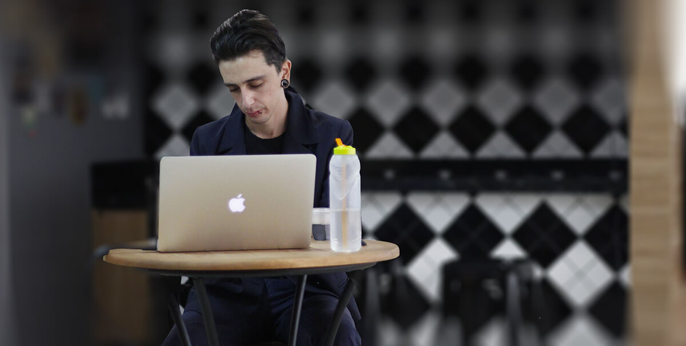

# Hey, I'm Julio Vedovatto 🙋🏻‍♂️

I'm Front End Developer based on Brazil 🇧🇷

Also, I'm a gamer, geek, frenchies lover and Aikido entusiast.

Most of all, a curious/inquisitive person. Always pursuing new and optimal ways to solve problems 🦾

>
> "In some ways, programming is like painting. You start with a blank canvas and certain basic raw materials. You use a combination of science, art, and craft to determine what to do with them."
> - Andrew Hunt
>

## Stats 📈

 

### Languages and Tools 🛠

### About me 👨🏻‍🎤

* I have a inquisitive nature, I love to ask a lot of questions 🤓
* I seek leadership roles, where I believe that I can contribute much more than just written code 🚀
* I have graduate course on Interaction Design, I ❤️ a good UI/UX.
* I **need** to listen music while working 
* I'm co-organizer of [FEMUG Maringá](https://www.meetup.com/pt-BR/femugmga/).
* I have [some talks](https://github.com/juliovedovatto/palestras) related to Front End development.

<!--
**juliovedovatto/juliovedovatto** is a ✨ _special_ ✨ repository because its `README.md` (this file) appears on your GitHub profile.

Here are some ideas to get you started:

- 🔭 I’m currently working on ...
- 🌱 I’m currently learning ...
- 👯 I’m looking to collaborate on ...
- 🤔 I’m looking for help with ...
- 💬 Ask me about ...
- 📫 How to reach me: ...
- 😄 Pronouns: ...
- ⚡ Fun fact: ...
-->
